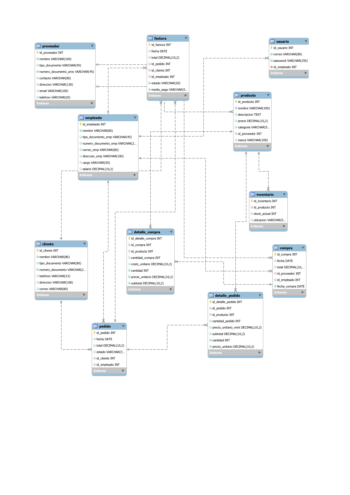

# 🏗️ ERP ConstruHogar: Sistema de Gestión Integral

[](LICENSE)
[](https://www.oracle.com/java/)
[](https://spring.io/projects/spring-boot)
[](https://reactjs.org/)

## 📝 Descripción del Proyecto
**ConstruHogar** no es solo un software de ventas; es una solución de **Análisis de Software** diseñada para profesionalizar la operación de ferreterías medianas. El proyecto nace de una necesidad real de negocio: optimizar la cadena de suministros y asegurar la integridad de los datos financieros en sectores de alta rotación de inventario.

Como **Analista y Desarrollador**, mi enfoque fue transformar requerimientos complejos en una arquitectura escalable, aplicando los estándares de calidad del **SENA**.

---

## 📊 Documentación de Análisis (El Corazón del Proyecto)
A diferencia de un desarrollo convencional, este proyecto cuenta con una base sólida de ingeniería documental. Puedes consultar los artefactos completos en la carpeta [/docs](./docs):

* **Análisis de Negocio:** Formulación, recolección de requisitos y propuestas técnico-económicas.
* **Modelado:** Diagramas de Casos de Uso y Artefactos del Modelo Entidad-Relación (MER).
* **Gestión:** Historias de usuario detalladas y metodologías de desarrollo.

> **Nota:** Como Administrador de Empresas con +7 años de trayectoria profesional, mi enfoque no es solo escribir código, sino diseñar soluciones tecnológicas que impulsen la rentabilidad, optimicen procesos operativos y cumplan con los objetivos financieros de la organización.

---

## 🛠️ Stack Tecnológico
Para garantizar robustez y velocidad, utilicé:
* **Backend:** Java 17 con Spring Boot (Spring Security, JPA/Hibernate).
* **Frontend:** React con arquitectura basada en componentes y gestión de estado eficiente.
* **Base de Datos:** MySQL (Diseñada para mantener integridad referencial estricta).

---

## 📐 Diseño de Arquitectura
Para este sistema, diseñé una estructura de datos normalizada que asegura la integridad de la información de inventarios:


*Vista previa del Modelo Entidad Relación (MER) diseñado para ConstruHogar.*

---

## 🚀 Arquitectura del Repositorio
```text
/construhogar-erp
├── 📂 docs         # Ingeniería: MER, Historias de Usuario, Casos de Uso.
├── 📂 backend      # API Restful estructurada por capas.
└── 📂 frontend     # Interfaz de usuario moderna y responsive.